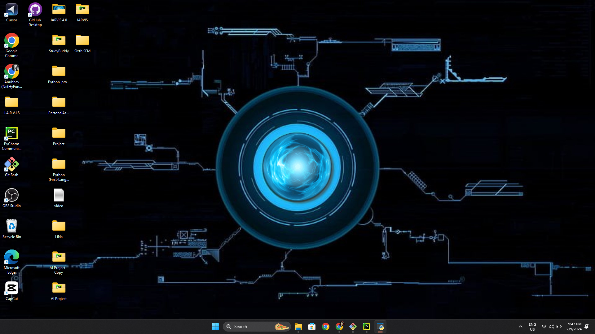

```markdown
# J.A.R.V.I.S - Just A Rather Very Intelligent System


## Overview

J.A.R.V.I.S is an intelligent system designed to [briefly describe the primary purpose or functionality of your project].

## Table of Contents

- [Features](#features)
- [Project Structure](#project-structure)
- [Installation](#installation)
- [Usage](#usage)
- [Contributing](#contributing)
- [License](#license)

## Features

- [List key features of your project]

## Project Structure

```
/                           # Root directory
  .idea/                    # IntelliJ IDEA project files
  Automation/               # Automation module
  BRAIN/                    # BRAIN module
  DATA/                     # DATA module
  FUNCTION/                 # FUNCTION module
  MAIN/                     # MAIN module
  USER_INTERFACE/           # USER_INTERFACE module
```

## Installation

[Provide detailed instructions on how to install and set up your project. Include any dependencies and prerequisites.]

```bash
# Example installation steps
git clone https://github.com/AnubhavChaturvedi-GitHub/J.A.R.V.I.S.git
cd J.A.R.V.I.S
# Additional installation commands if needed
```

## Usage

[Explain how to use your project. Provide code examples, configuration details, or any relevant information.]

## Contributing

We welcome contributions! If you'd like to contribute to J.A.R.V.I.S, please follow our [Contribution Guidelines](CONTRIBUTING.md).

## License

This project is licensed under the [MIT License](LICENSE).
```

Remember to replace placeholders like `[briefly describe the primary purpose or functionality of your project]` with a concise description, and provide links, logos, or images as needed.

Feel free to customize the template further based on the specifics of your project. This should give you a professional and informative `README.md` for your J.A.R.V.I.S project.
